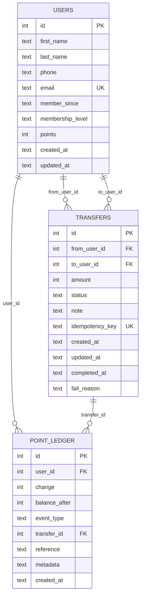

# Database ER Diagram

## Entity Relationship Diagram

## Entity Descriptions

### USERS
- **Primary Key**: `id` (Auto-increment)
- **Unique Constraints**: `email`
- **Purpose**: Stores user information and current point balance
- **Key Fields**:
  - `points`: Current point balance
  - `membership_level`: User tier (Bronze, Silver, Gold, etc.)
  - `member_since`: Date when user joined

### TRANSFERS
- **Primary Key**: `id` (Auto-increment)
- **Unique Constraints**: `idempotency_key`
- **Foreign Keys**: 
  - `from_user_id` → `users.id`
  - `to_user_id` → `users.id`
- **Purpose**: Records point transfer transactions between users
- **Status Values**: 
  - `pending`: Transfer initiated
  - `processing`: Transfer being processed
  - `completed`: Transfer successful
  - `failed`: Transfer failed
  - `cancelled`: Transfer cancelled
  - `reversed`: Transfer reversed
- **Constraints**: 
  - `amount > 0`: Only positive amounts allowed
  - `idempotency_key`: Prevents duplicate transfers

### POINT_LEDGER
- **Primary Key**: `id` (Auto-increment)
- **Foreign Keys**: 
  - `user_id` → `users.id`
  - `transfer_id` → `transfers.id` (nullable)
- **Purpose**: Audit trail for all point changes
- **Event Types**:
  - `transfer_out`: Points deducted for outgoing transfer
  - `transfer_in`: Points added from incoming transfer
  - `adjust`: Manual point adjustment
  - `earn`: Points earned from activities
  - `redeem`: Points redeemed for rewards
- **Key Fields**:
  - `change`: Point change amount (positive or negative)
  - `balance_after`: User's point balance after this transaction
  - `metadata`: Additional transaction data (JSON format)

## Relationships

1. **User to Transfers (One-to-Many)**
   - A user can have multiple outgoing transfers (`from_user_id`)
   - A user can have multiple incoming transfers (`to_user_id`)

2. **User to Point Ledger (One-to-Many)**
   - Each user has multiple ledger entries tracking their point history

3. **Transfer to Point Ledger (One-to-Many)**
   - Each transfer creates multiple ledger entries (one for sender, one for receiver)
   - Transfer ID can be null for non-transfer related point changes

## Indexes

### Transfer Indexes
- `idx_transfers_from`: On `from_user_id` for faster user transfer queries
- `idx_transfers_to`: On `to_user_id` for faster user transfer queries
- `idx_transfers_created`: On `created_at` for chronological sorting
- `idx_transfers_idem_key`: On `idempotency_key` for duplicate prevention

### Point Ledger Indexes
- `idx_ledger_user`: On `user_id` for faster user ledger queries
- `idx_ledger_transfer`: On `transfer_id` for transfer-related ledger entries
- `idx_ledger_created`: On `created_at` for chronological sorting

## Business Rules

1. **Point Transfer Rules**:
   - Users cannot transfer to themselves
   - Transfer amount must be positive
   - Sender must have sufficient points
   - Each transfer must have a unique idempotency key

2. **Point Ledger Rules**:
   - Every point change must be recorded
   - Balance after must be calculated correctly
   - Transfer-related entries must reference the transfer ID

3. **Data Integrity**:
   - Email addresses must be unique
   - Foreign key constraints ensure referential integrity
   - Check constraints validate status and event type values