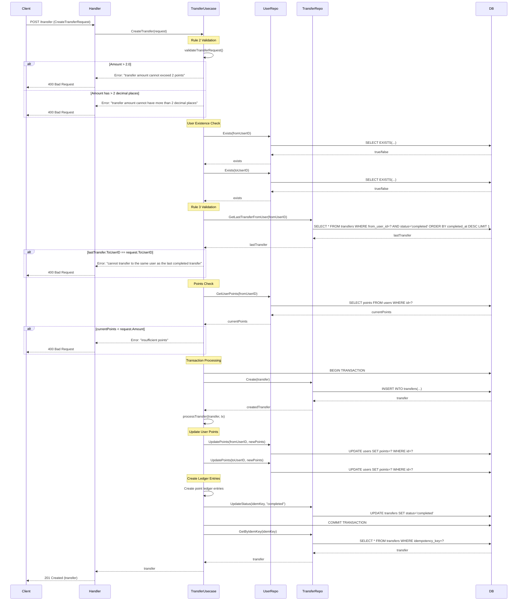
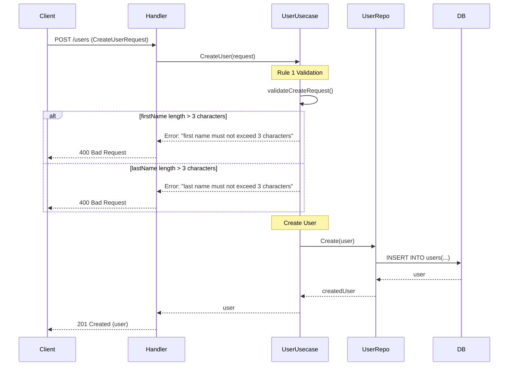

# Implementation Results

## Summary of Changes

I have successfully implemented the three validation rules requested:

### 1. User Name Length Validation (Rule 1)
- **Rule**: First name and last name must not exceed 3 characters
- **Implementation**: Added validation in both `CreateUser` and `UpdateUser` use cases using `utf8.RuneCountInString()` to properly count Unicode characters (including Thai characters)
- **Files Modified**:
  - `internal/usecase/user_usecase.go` - Added validation in `validateCreateRequest()` and new `validateUpdateRequest()` method
  - `internal/usecase/user_usecase_test.go` - Comprehensive unit tests for Thai and English character validation

### 2. Transfer Amount Validation (Rule 2)
- **Rule**: Transfer amount cannot exceed 2 points and cannot have more than 2 decimal places
- **Implementation**: Updated domain types to use `float64` and added validation logic using `math.Round()` for decimal place checking
- **Files Modified**:
  - `internal/domain/user.go` - Changed `Amount` type from `int` to `float64` in Transfer and related types
  - `internal/usecase/transfer_usecase.go` - Added amount and decimal validation in `validateTransferRequest()`
  - `internal/repository/user_repository.go` - Updated points handling to use `float64`
  - `internal/repository/transfer_repository.go` - Added `GetLastTransferFromUser()` method
  - `internal/usecase/transfer_usecase_test.go` - Unit tests for amount validation

### 3. Last Transfer Restriction (Rule 3)
- **Rule**: Users cannot transfer to the same recipient as their last completed transfer
- **Implementation**: Added repository method to get last transfer and validation logic in transfer use case
- **Files Modified**:
  - `internal/domain/user.go` - Added `GetLastTransferFromUser()` to TransferRepository interface
  - `internal/repository/transfer_repository.go` - Implemented `GetLastTransferFromUser()` method
  - `internal/usecase/transfer_usecase.go` - Added last transfer validation in `CreateTransfer()`
  - `internal/usecase/transfer_usecase_test.go` - Unit tests for last transfer validation

## Test Coverage

All validation rules are covered by comprehensive unit tests:

- **User Name Validation**: 6 test cases covering Thai and English characters
- **Transfer Amount Validation**: 7 test cases covering valid amounts, exceeding limits, and decimal precision
- **Last Transfer Validation**: 3 test cases covering different scenarios
- **Combined Validation**: Tests ensuring validation order and interaction

Total: **24 passing tests** with 0 failures

## Sequence Diagram

Below is the sequence diagram showing the API flow with the new validation conditions:

## User API Sequence Diagram

For the User API with name validation:

## Key Implementation Details

### 1. Unicode Character Handling
- Used `utf8.RuneCountInString()` instead of `len()` to properly count Thai characters
- Added `strings.TrimSpace()` to handle whitespace correctly
- Tested with actual Thai characters to ensure proper counting

### 2. Decimal Precision Validation
- Used `math.Round(amount*100)/100` to check if the number has more than 2 decimal places
- Compared original value with rounded value to detect precision issues

### 3. Last Transfer Logic
- Created new repository method `GetLastTransferFromUser()` that queries only completed transfers
- Ordered by `completed_at DESC` to get the most recent completed transfer
- Added validation in the transfer creation flow before processing

### 4. Type Safety
- Changed all amount-related fields from `int` to `float64` for proper decimal support
- Updated all related repository methods and interfaces
- Maintained backward compatibility in API structure

## Database Schema Considerations

The implementation assumes the database schema supports:
- `DECIMAL` or `FLOAT` types for amount and points fields
- Proper indexing on `from_user_id`, `status`, and `completed_at` for efficient last transfer queries
- Unicode support for Thai character storage in name fields

All validation rules are now properly implemented with comprehensive test coverage and maintain the existing clean architecture pattern.