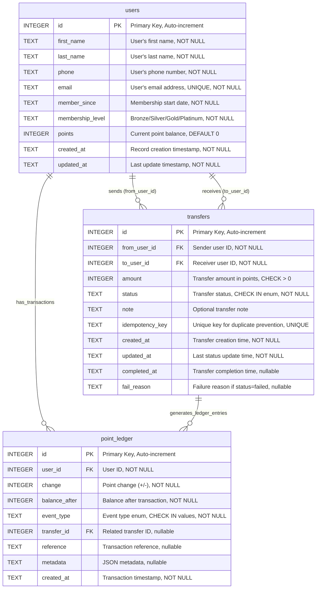

# Database Schema Documentation

This document describes the database schema for the LBK Points Transfer API system, implemented using SQLite.

## Database Overview

The system consists of 3 main tables:
- **users**: User profile and point balance management
- **transfers**: Point transfer transactions between users
- **point_ledger**: Audit trail for all point transactions (append-only)

## Entity Relationship Diagram



## Table Details

### users
**Purpose**: Store user profile information and current point balance.

**Key Features**:
- Auto-incrementing primary key
- Email uniqueness constraint
- Membership levels: Bronze, Silver, Gold, Platinum
- Point balance tracking
- Timestamp tracking for audit

**Sample Data**:
```sql
INSERT INTO users (first_name, last_name, phone, email, member_since, membership_level, points, created_at, updated_at) 
VALUES ('John', 'Doe', '+66812345678', 'john.doe@example.com', '2025-01-01T00:00:00Z', 'Gold', 1500, '2025-01-01T00:00:00Z', '2025-01-01T00:00:00Z');
```

### transfers
**Purpose**: Store point transfer transactions between users with status tracking.

**Key Features**:
- Bidirectional foreign keys to users table
- Status enum validation: 'pending', 'processing', 'completed', 'failed', 'cancelled', 'reversed'
- Idempotency key for duplicate prevention
- Amount validation (must be > 0)
- Complete audit trail with timestamps

**Indexes**:
- `idx_transfers_from` on from_user_id
- `idx_transfers_to` on to_user_id  
- `idx_transfers_created` on created_at

### point_ledger
**Purpose**: Append-only audit log for all point transactions.

**Key Features**:
- Event type validation: 'transfer_out', 'transfer_in', 'adjust', 'earn', 'redeem'
- Balance tracking after each transaction
- Optional link to transfer record
- JSON metadata support for additional context
- Complete transaction history preservation

**Indexes**:
- `idx_ledger_user` on user_id
- `idx_ledger_transfer` on transfer_id
- `idx_ledger_created` on created_at

## Business Rules

1. **Transfer Atomicity**: Each transfer creates exactly 2 ledger entries (one debit, one credit)
2. **Balance Consistency**: Point ledger maintains running balance for each user
3. **Idempotency**: Duplicate transfers prevented by unique idempotency_key
4. **Audit Trail**: All point movements recorded in point_ledger (append-only)
5. **Status Flow**: Transfers progress: pending → (processing) → completed/failed

## Relationships

- **One-to-Many**: users → transfers (via from_user_id)
- **One-to-Many**: users → transfers (via to_user_id)  
- **One-to-Many**: users → point_ledger (transaction history)
- **One-to-Many**: transfers → point_ledger (each transfer generates 2 entries)

## Data Integrity

### Foreign Key Constraints
- `transfers.from_user_id` → `users.id`
- `transfers.to_user_id` → `users.id`
- `point_ledger.user_id` → `users.id`
- `point_ledger.transfer_id` → `transfers.id`

### Check Constraints
- `transfers.amount > 0`
- `transfers.status IN ('pending','processing','completed','failed','cancelled','reversed')`
- `point_ledger.event_type IN ('transfer_out','transfer_in','adjust','earn','redeem')`

### Unique Constraints
- `users.email` (unique across system)
- `transfers.idempotency_key` (prevents duplicate transfers)

## Performance Considerations

- Indexes on frequently queried columns (user_id, created_at, transfer relationships)
- Append-only ledger design for optimal insert performance
- Separate balance tracking in ledger prevents need for complex aggregations
- Idempotency key lookup optimization for duplicate detection