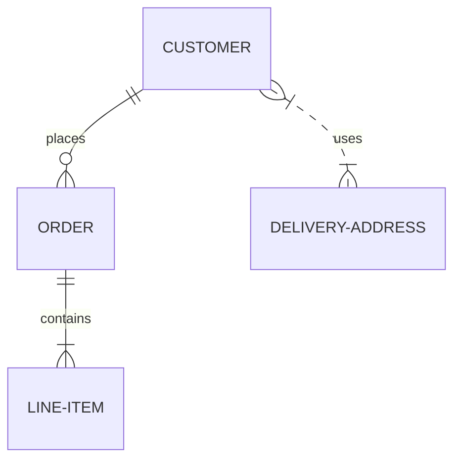

# 4.1 เพิ่ม API ตามโจทย์เหล่านี้

## 1. เพิ่ม CRUD Users (ใช้รูป)
- เพิ่ม CRUD Users + ต่อเข้ากับ SQLite โดยให้มี field ที่สอดคล้องกับ UI ในรูป `workshop-4/specs/profile.png` และสอดคล้องกับ list api ด้านล่างนี้
  - `GET /users` ใช้สำหรับดึง รายการผู้ใช้ทั้งหมด
  - `GET /users/{id}` ใช้สำหรับดึงข้อมูล รายละเอียดผู้ใช้รายบุคคล
  - `POST /users` ใช้สำหรับ สร้างผู้ใช้ใหม่
  - `PUT /users/{id}` ใช้สำหรับ แก้ไขข้อมูลผู้ใช้
  - `DELETE /users/{id}` ใช้สำหรับ ลบผู้ใช้

* ใครเพิ่มเสร็จ และ code architecture ไม่สวย ให้ refactor ด้วย เช่น เป็น clean architecture ได้
** หากใครอยากเพิ่มให้เรียบร้อยขึ้นสำหรับส่วนต่อ DB ก็เปลี่ยนไปเป็น ORM เช่น GORM ได้

## 2. เพิ่ม Feature ให้สามารถ Transfer points ระหว่าง users ได้ (ใช้ swagger)
- ใช้ API specs swagger ไฟล์ `workshop-4/specs/transfer.yml` เป็นตัวกำกับและบอกเพิ่ม feature โดยเพิ่มอีก 2 table โดยใช้ query ด้านล่างนี้อ้างอิง

1. transfers — เก็บคำสั่งโอน + idemKey (ใช้ค้นหา)
```sql
CREATE TABLE IF NOT EXISTS transfers (
  id INTEGER PRIMARY KEY AUTOINCREMENT,
  from_user_id INTEGER NOT NULL,
  to_user_id INTEGER NOT NULL,
  amount INTEGER NOT NULL CHECK (amount > 0),
  status TEXT NOT NULL CHECK (status IN ('pending','processing','completed','failed','cancelled','reversed')),
  note TEXT,
  idempotency_key TEXT NOT NULL UNIQUE,     -- ใช้เป็น id ใน GET /transfers/{id}
  created_at TEXT NOT NULL,
  updated_at TEXT NOT NULL,
  completed_at TEXT,
  fail_reason TEXT,
  FOREIGN KEY (from_user_id) REFERENCES users(id),
  FOREIGN KEY (to_user_id) REFERENCES users(id)
);

CREATE INDEX IF NOT EXISTS idx_transfers_from     ON transfers(from_user_id);
CREATE INDEX IF NOT EXISTS idx_transfers_to       ON transfers(to_user_id);
CREATE INDEX IF NOT EXISTS idx_transfers_created  ON transfers(created_at);
```

2. point_ledger — สมุดบัญชีแต้ม (append-only)
```sql
CREATE TABLE IF NOT EXISTS point_ledger (
  id INTEGER PRIMARY KEY AUTOINCREMENT,
  user_id INTEGER NOT NULL,
  change INTEGER NOT NULL,                  -- +รับโอน / -โอนออก
  balance_after INTEGER NOT NULL,
  event_type TEXT NOT NULL CHECK (event_type IN ('transfer_out','transfer_in','adjust','earn','redeem')),
  transfer_id INTEGER,                      -- อ้างถึง transfers.id (ไอดีภายใน)
  reference TEXT,
  metadata TEXT,                            -- JSON text
  created_at TEXT NOT NULL,
  FOREIGN KEY (user_id) REFERENCES users(id),
  FOREIGN KEY (transfer_id) REFERENCES transfers(id)
);

CREATE INDEX IF NOT EXISTS idx_ledger_user     ON point_ledger(user_id);
CREATE INDEX IF NOT EXISTS idx_ledger_transfer ON point_ledger(transfer_id);
CREATE INDEX IF NOT EXISTS idx_ledger_created  ON point_ledger(created_at);
```

* ขั้นตอนนี้ เราจะตรวจจาก swagger ของ project ให้ push swagger ของ project ตัวเองขึ้นมา (จะใช้ library generate หรือ AI generate ก็ได้) = ผลลัพธ์เป็น `result.yml` เป็น swagger format
** (optional) สามารถ challenge เพิ่มได้โดยการเปลี่ยน user เป็น Authentication

## 3. ขอ ER Diagram ใน Mermaid format
- ขอ Database Document follow ตาม practice https://docs.mermaidchart.com/mermaid-oss/syntax/entityRelationshipDiagram.html
- update ผ่าน repo ชื่อ `database.md` ผ่าน git มาได้เลย​โดยใช้ tag mermaid เป็นตัวกำกับ เช่น



## 4. เขียน Readme ให้เรียบร้อย

# 4.2 Unit test

จงเพิ่ม code + unit test โดย follow ตาม case ด้านล่างต่อไปนี้
1. ชื่อ user `first_name` และ `last_name` ห้ามเกิน 3 ตัวอักษร
2. transfer โอนได้สูงสุดครั้งละไม่เกิน 2 บาท / แต้ม และ ทศนิยมไม่เกิน 2 ตำแหน่ง
3. หากครั้งล่าสุด user A เคยโอนให้ user B ไปแล้ว จะไม่สามารถโอนซ้ำได้อีก (การโอนจะไม่สามารถโอนซ้ำกับ user ที่พึ่งโอนไปครั้งล่าสุดได้)

ผลลัพธ์ที่อยากได้
1. code unit test confirm ว่า ทำ 3 อย่างนี้แล้ว
2. sequence diagram ของ API ที่มีการแก้ไข เพื่อยืนยันว่า แก้ไข condition ไปอย่างไร เขียนลงใน `result.md`
3. (ถ้ามี) แก้ไข DB diagram เพิ่มเติม ให้ update เพิ่มลงใน `database.md` ด้วย

* แนะนำให้ทำทีละเคส
** หากใครผลลัพธ์ออกช้าจัด สามารถตัดเคสข้อ 3 ทิ้งได้ แต่ถ้าใครอยากเห็นว่า AI Agent พยายามแก้ test case ยังไงสามารถลองได้